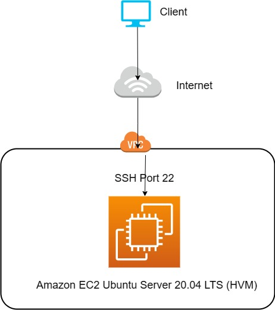
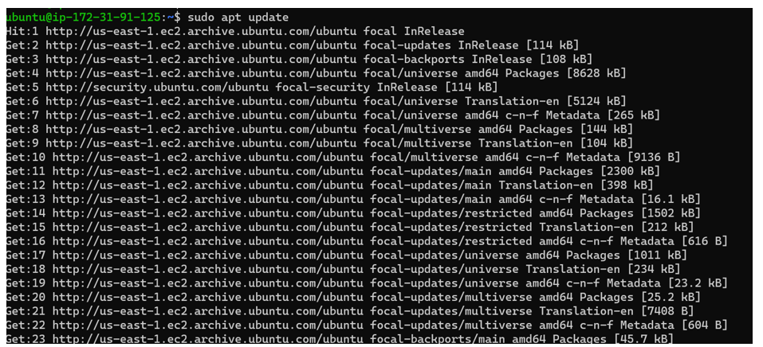
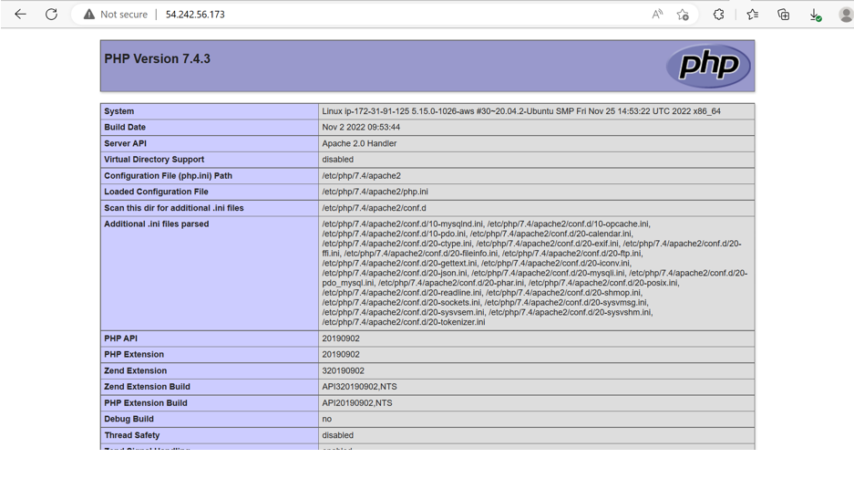

## Awesome documentation for project 1 - Deploying a PHP MYSQL Application on Apache2 Server using Ubuntu 20.04 OS

`sudo apt update`

`sudo apt install apache2`

`sudo systemctl status apache2`

`sudo apt install mysql-server`

`sudo mysql`

`ALTER USER 'root'@'localhost' IDENTIFIED WITH mysql_native_password BY 'PassWord.1';`

`sudo apt install php libapache2-mod-php php-mysql`

`sudo mkdir /var/www/projectlamp`

`sudo chown -R $USER:$USER /var/www/projectlamp`

`sudo echo 'Hello LAMP from hostname' $(curl -s http://169.254.169.254/latest/meta-data/public-hostname) 'with public IP' $(curl -s http://169.254.169.254/latest/meta-data/public-ipv4 > /var/www/projectlamp/index.html`

`sudo vim /etc/apache2/mods-enabled/dir.conf`

### Change the Order of index.html and index.php

`sudo vim /etc/apache2/mods-enabled/dir.conf`

### Change this
`<IfModule mod_dir.c>`
        `DirectoryIndex index.html index.cgi index.pl index.php index.xhtml index.htm`
`</IfModule>`

`<IfModule mod_dir.c>`
        `DirectoryIndex index.php index.html index.cgi index.pl index.xhtml index.htm`
`</IfModule>`

`vim /var/www/projectlamp/index.php`

### Put this into index.php file

`<?php`
`phpinfo();`

`sudo systemctl reload apache2`

