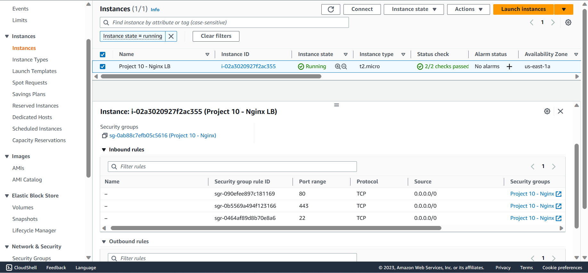
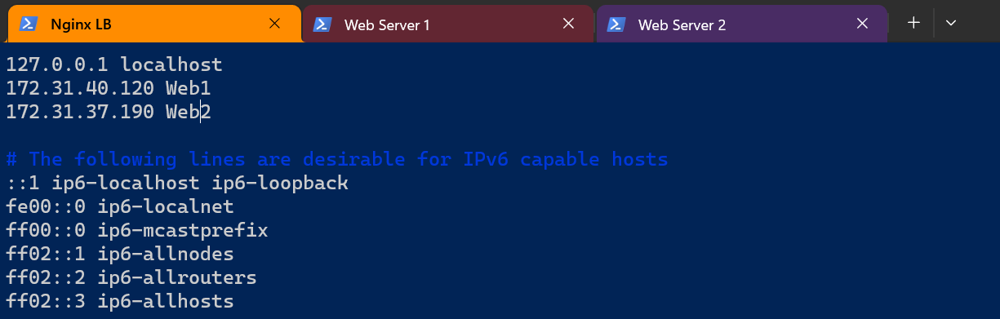
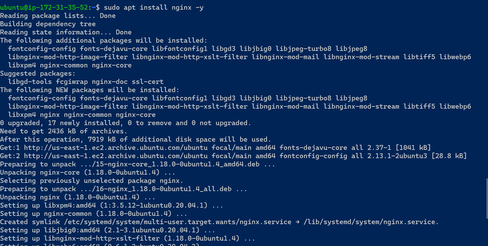
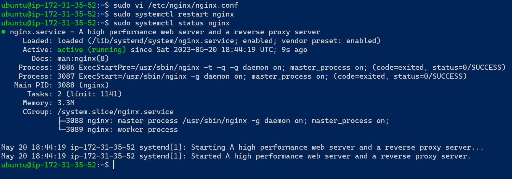

## CONFIGURE NGINX AS A LOAD BALANCER

`1 - Create an EC2 VM based on Ubuntu Server 20.04 LTS and name it Nginx LB (do not forget to open TCP port 80 for HTTP connections, also open TCP port 443 – this port is used for secured HTTPS connections)`

`2 - Update /etc/hosts file for local DNS with Web Servers’ names (e.g. Web1 and Web2) and their local IP addresses`

`3 - Install and configure Nginx as a load balancer to point traffic to the resolvable DNS names of the webservers`

