## INSTALL AND CONFIGURE ANSIBLE ON EC2 INSTANCE

`1 - Update Name tag on your Jenkins EC2 Instance to Jenkins-Ansible. We will use this server to run playbooks.`

`2 - In your GitHub account create a new repository and name it ansible-config-mgt.`

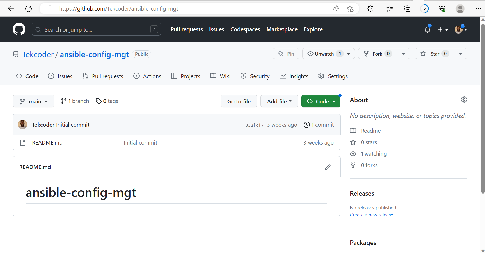

`3 - Install Ansible`

`sudo apt update`

`sudo apt install ansible`

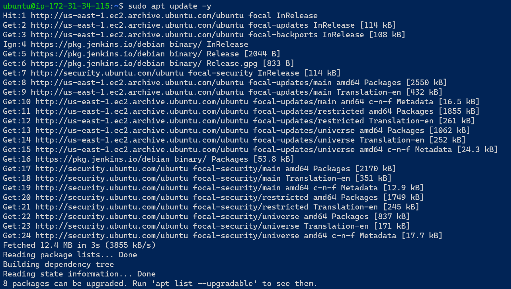

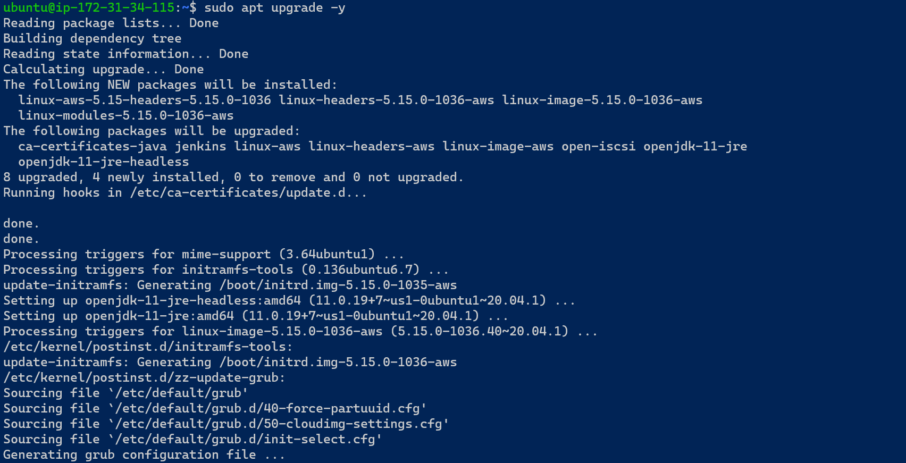

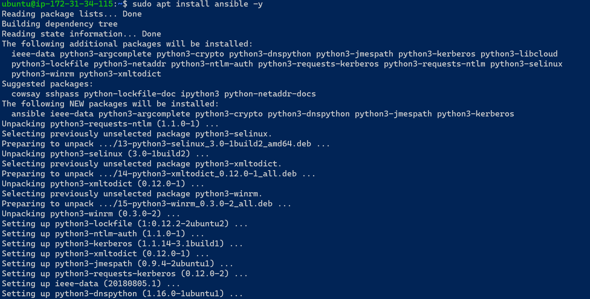

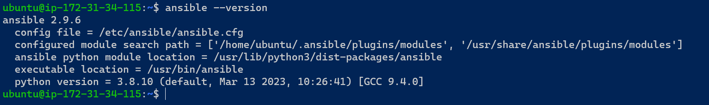

`4 - Configure Jenkins build job to save your repository content every time you change it – this will solidify your Jenkins configuration skills acquired in Project 9.`

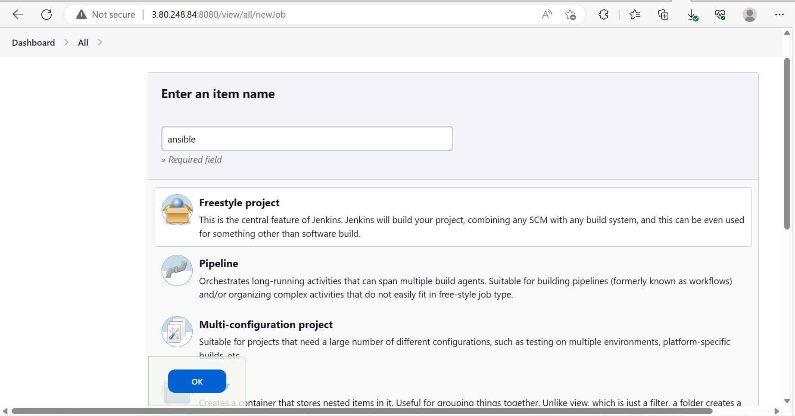

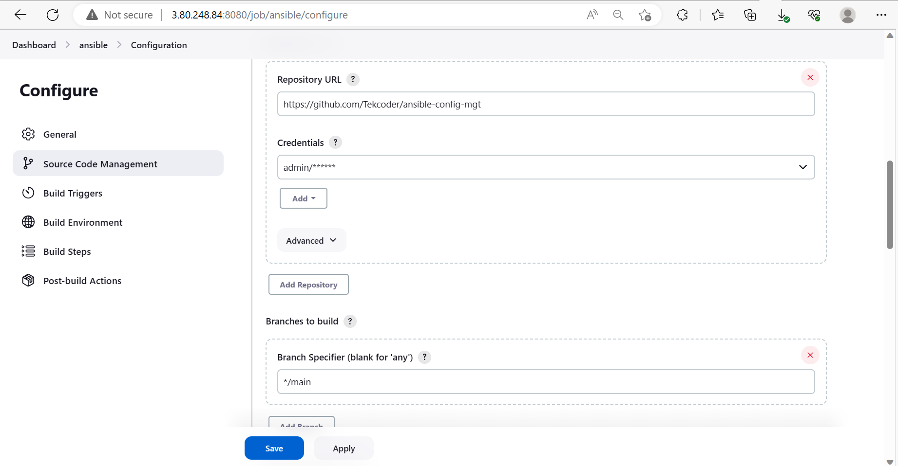

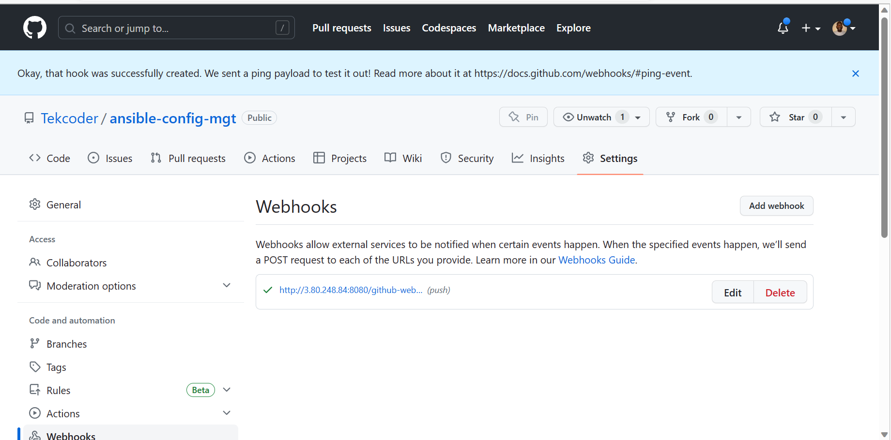

`5 - Test your setup by making some change in README.MD file in master branch and make sure that builds starts automatically and Jenkins saves the files (build artifacts) in following folder`

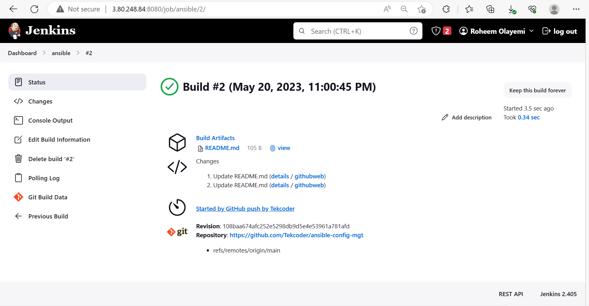

`ls /var/lib/jenkins/jobs/ansible/builds/<build_number>/archive/`

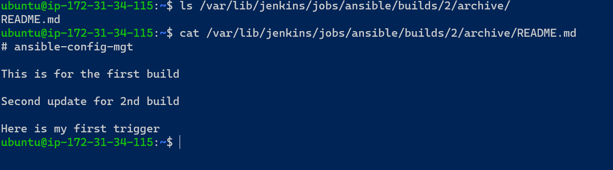

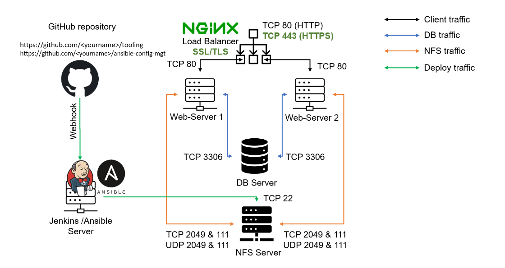

`NB: Assign an Elastic IP Address to the Jenkins Server`

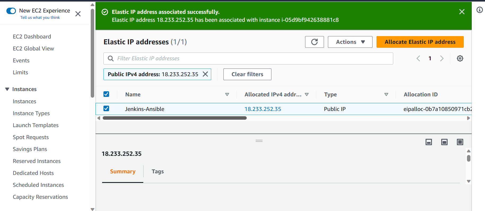

# Step 2 – Prepare your development environment using Visual Studio Code

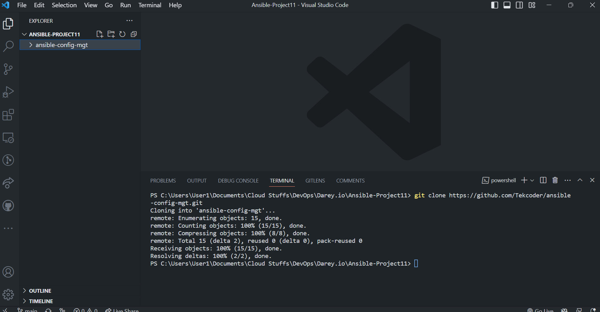
# BEGIN ANSIBLE DEVELOPMENT

`1 - In your ansible-config-mgt GitHub repository, create a new branch that will be used for development of a new feature.`

`2 - Checkout the newly created feature branch to your local machine and start building your code and directory structure`

`3 - Create a directory and name it playbooks – it will be used to store all your playbook files.`

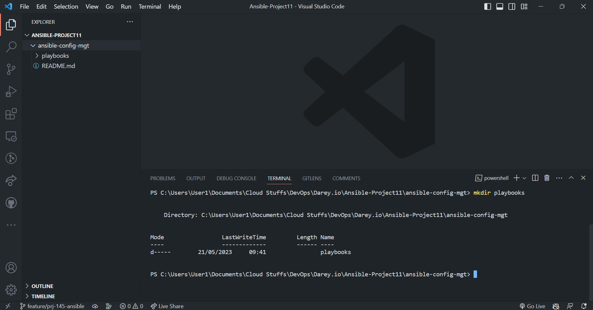

`4 - Create a directory and name it inventory – it will be used to keep your hosts organised.`

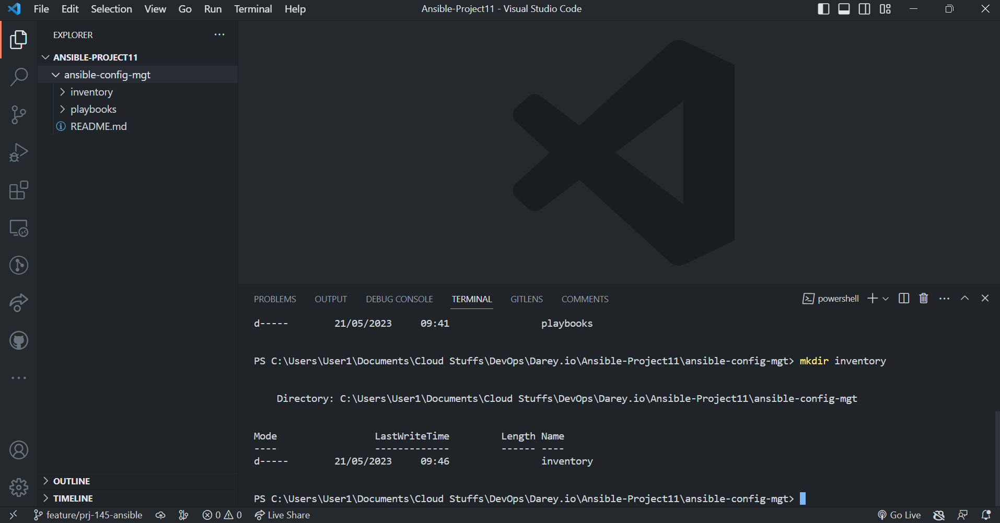

`5 - Within the playbooks folder, create your first playbook, and name it common.yml`

`6 - Within the inventory folder, create an inventory file (.yml) for each environment (Development, Staging Testing and Production) dev, staging, uat, and prod respectively.`

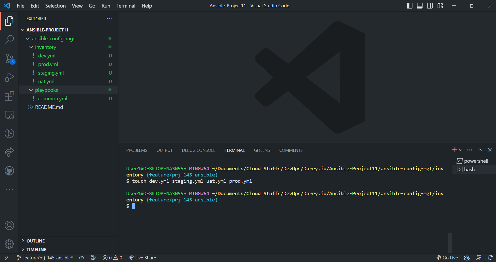

