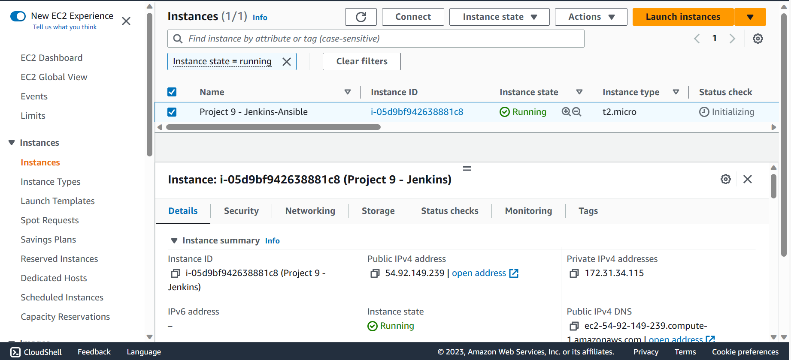

## INSTALL AND CONFIGURE ANSIBLE ON EC2 INSTANCE

`1 - Update Name tag on your Jenkins EC2 Instance to Jenkins-Ansible. We will use this server to run playbooks.`

`2 - In your GitHub account create a new repository and name it ansible-config-mgt.`

`3 - Install Ansible`

`sudo apt update`

`sudo apt install ansible`

