## AWS CLOUD SOLUTION FOR 2 COMPANY WEBSITES USING A REVERSE PROXY TECHNOLOGY

`1 - SET UP A VIRTUAL PRIVATE NETWORK (VPC)`

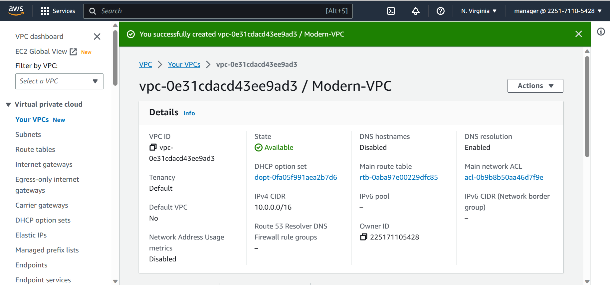

`2 - Enable DNS Hostnames for the VPC`

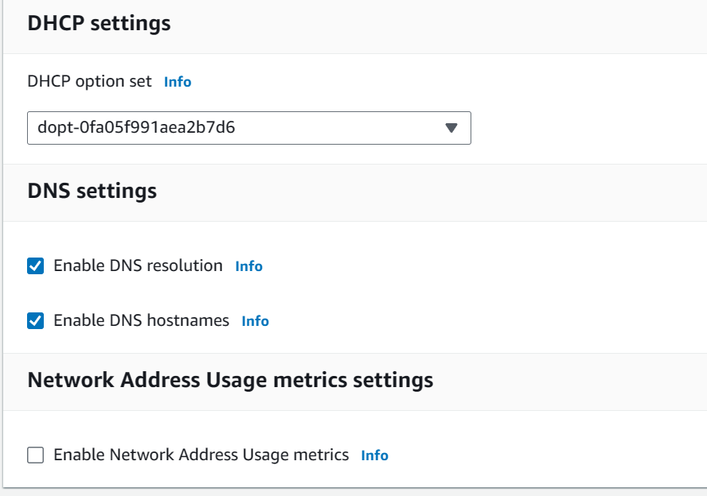

`3 - Create an Internet Gateway`

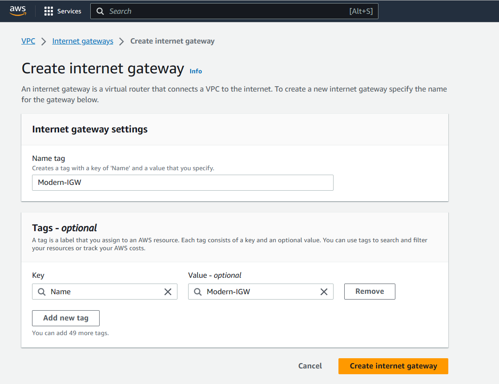
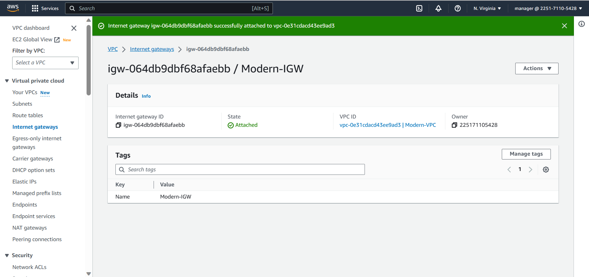

`4 - Create subnets as shown in the architecture`

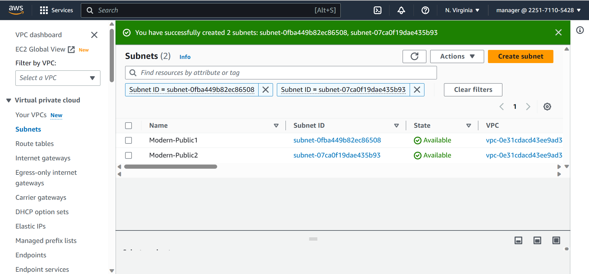

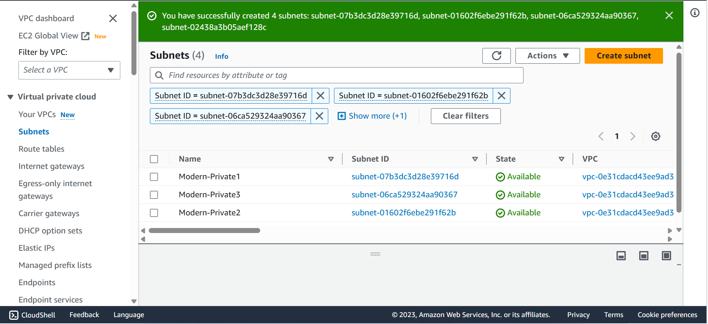

`5 - Create route table for the public subnet to use (Public Route Table)`

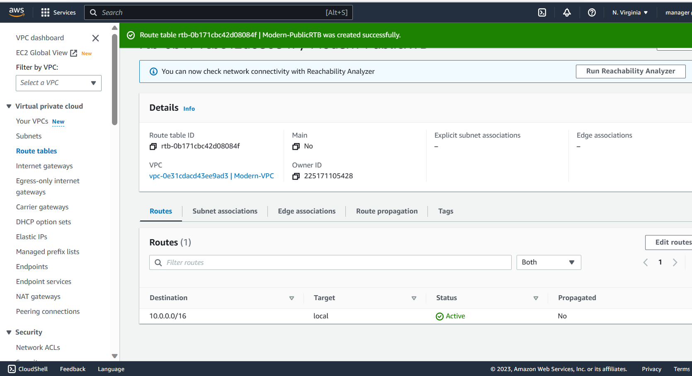

`6 - Create a route in the public route table and point to the Internet gateway`

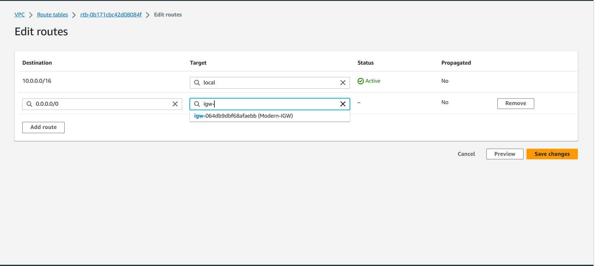
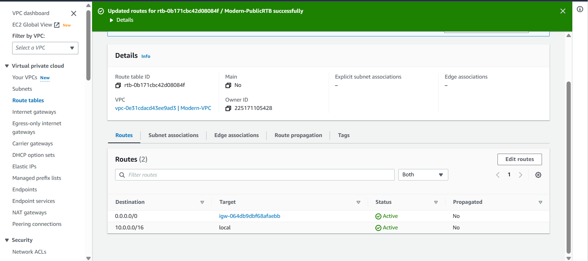

`7 - Associate the public subnets to the created route table`

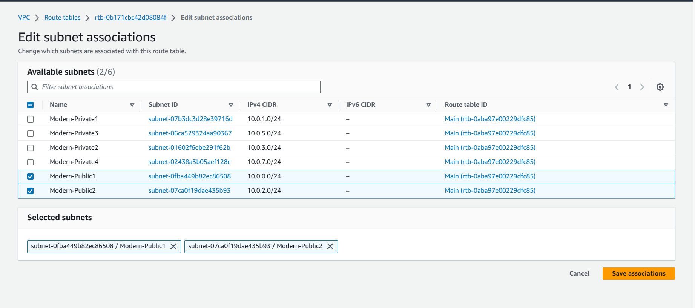

`8 - Create a NAT Gateway so that servers in the private subnet can reach the internet for example download stuff (Outbound)`

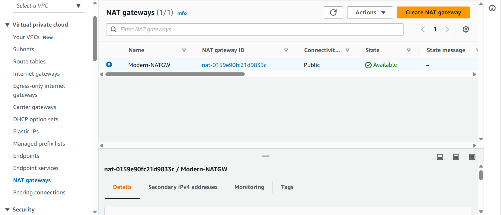
`9 - Create route table for the private subnet to use (Private Route Table)`

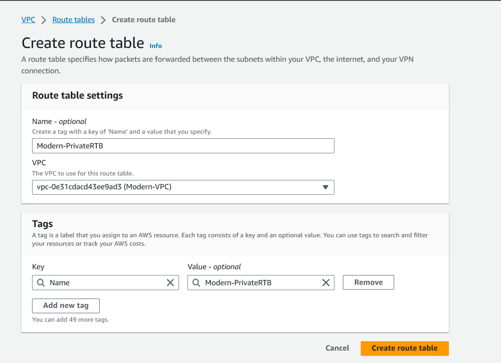
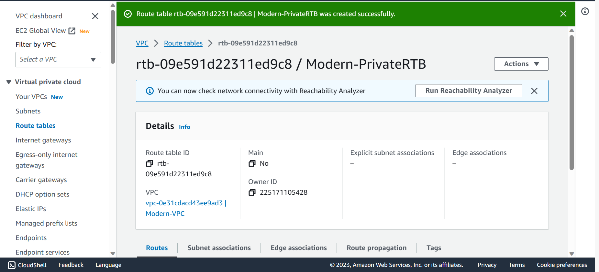

`10 - Create the Security Groups for External ALB, Reverse Proxy Nginx, Bastion Server, WordPress, Tooling, Internal ALB and Database Layer`

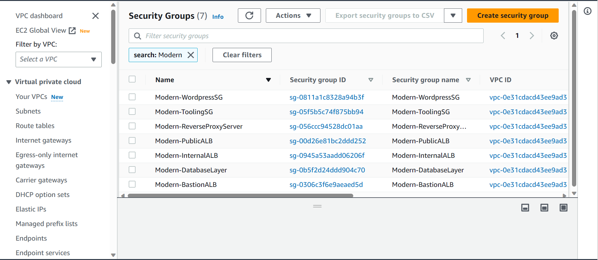

`11 - Created a Certificate for SSL in ACM`
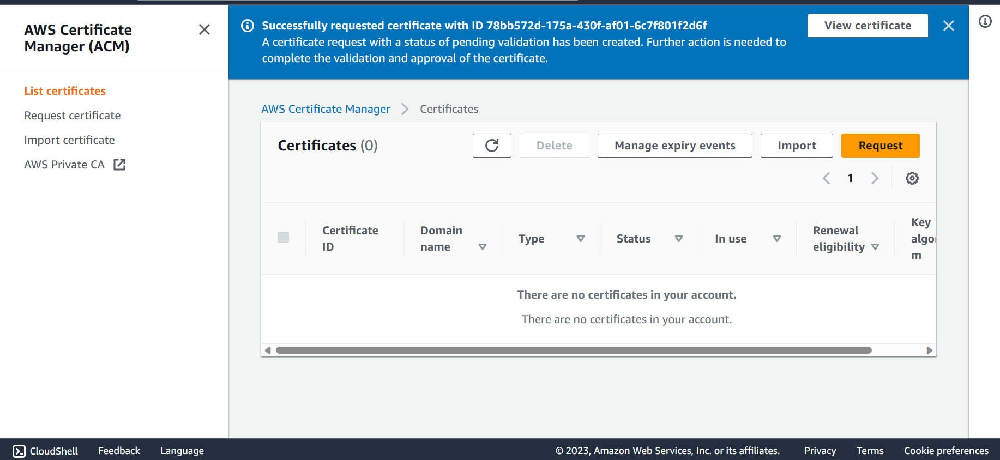
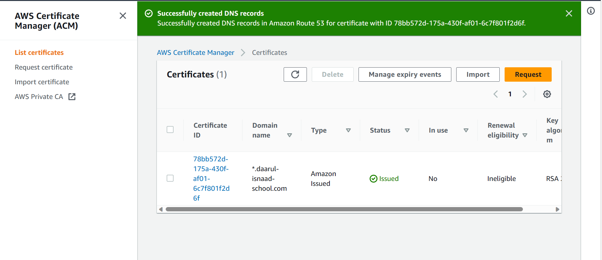
`12 - Created an Elastic FileSystem for persistent storage for files across the web servers`

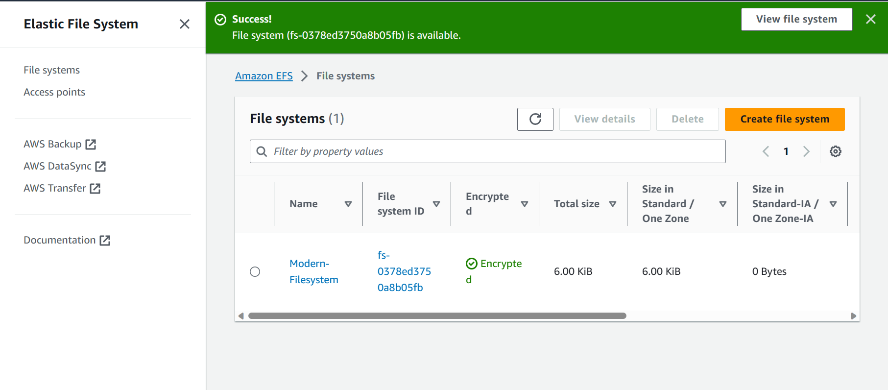

`13 - Created the Access point for the WordPress and Tooling webservers to mount on EFS`
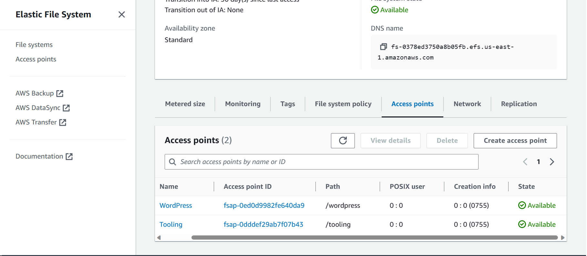

`14 - Created a KMS Key needed for the RDS Database`
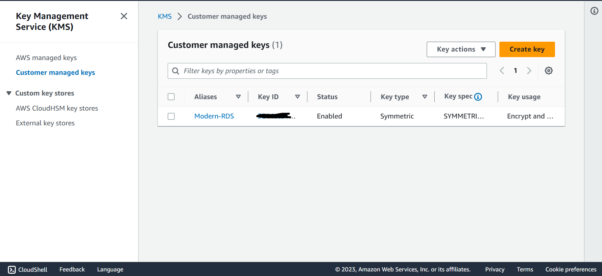
