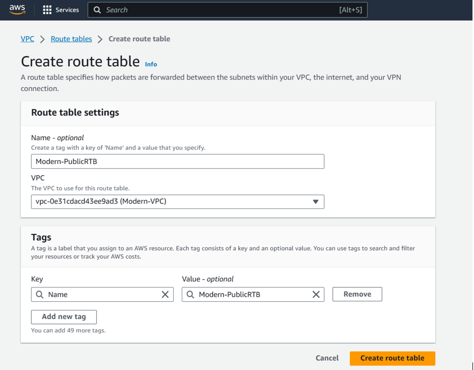

## AWS CLOUD SOLUTION FOR 2 COMPANY WEBSITES USING A REVERSE PROXY TECHNOLOGY

`1 - SET UP A VIRTUAL PRIVATE NETWORK (VPC)`

`2 - Enable DNS Hostnames for the VPC`

`3 - Create an Internet Gateway`

`4 - Create subnets as shown in the architecture`

`5 - Create route table for the public subnet to use (Public Route Table)`

`6 - Create a route in the public route table and point to the Internet gateway`

`7 - Associate the public subnets to the created route table`

`8 - Create a NAT Gateway so that servers in the private subnet can reach the internet for example download stuff (Outbound)`

`9 - Create route table for the private subnet to use (Private Route Table)`

