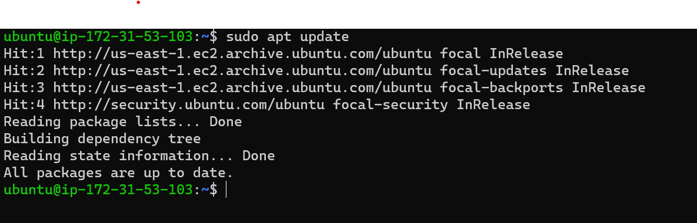
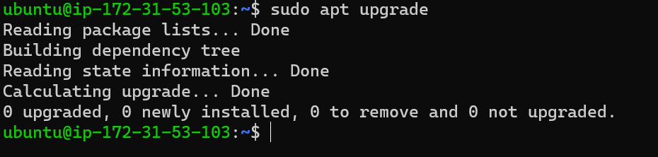
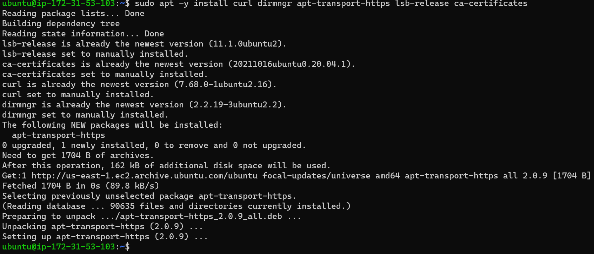
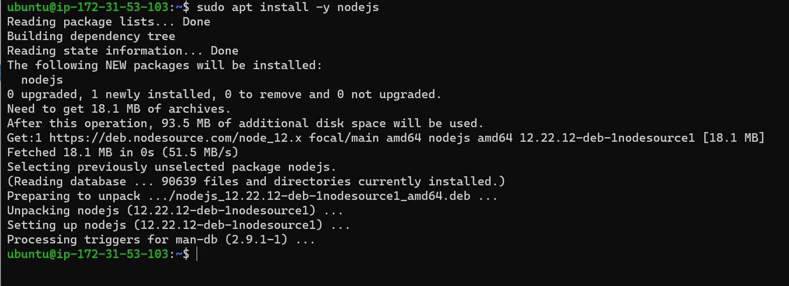
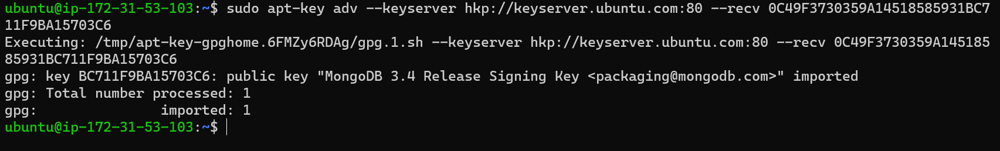
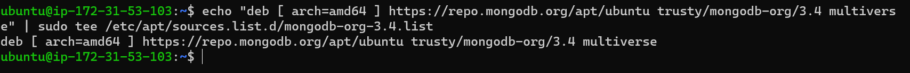
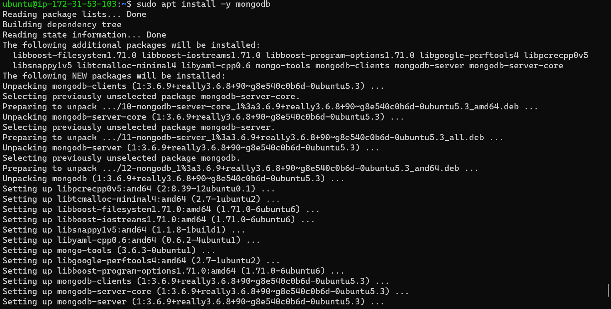

## Awesome documentation for project 4 - Deploying MEAN Stack Application on Express Server using Ubuntu 20.04 OS

`sudo apt update`

`sudo apt upgrade -y`

## Add certificates

`sudo apt -y install curl dirmngr apt-transport-https lsb-release ca-certificates`

`curl -sL https://deb.nodesource.com/setup_12.x | sudo -E bash -`

## Install Node
`sudo apt install -y nodejs`

## Add Mongo DB Key

`sudo apt-key adv --keyserver hkp://keyserver.ubuntu.com:80 --recv 0C49F3730359A14518585931BC711F9BA15703C6`

## Mongo DB Repository

`echo "deb [ arch=amd64 ] https://repo.mongodb.org/apt/ubuntu trusty/mongodb-org/3.4 multiverse" | sudo tee /etc/apt/sources.list.d/mongodb-org-3.4.list`

## Install MongoDB

`sudo apt install -y mongodb`

