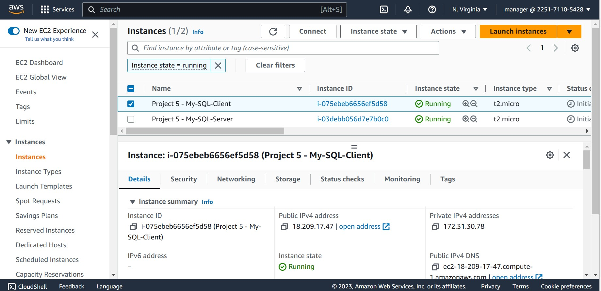
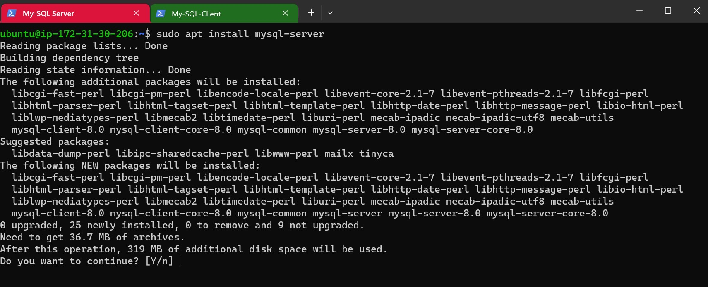
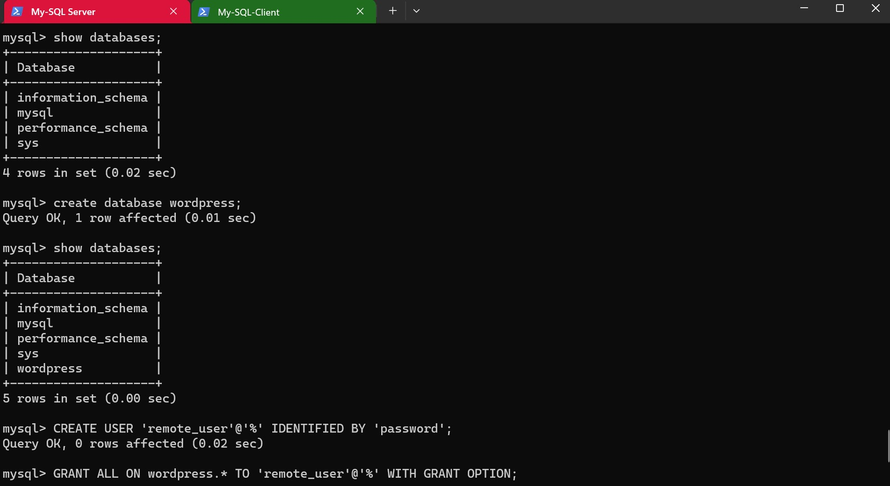

## Project 5 Documentation- CLIENT-SERVER ARCHITECTURE WITH MYSQL

# Create and configure two Linux-based virtual servers (EC2 instances in AWS)

# On mysql server Linux Server install MySQL Server software

# On Mysql client Linux Server Install MySQL Client Software

# Configured the MySQL server to allow connections from remote hosts

`sudo vi /etc/mysql/mysql.conf.d/mysqld.cnf`

# Create a user and a database on the Database Server

