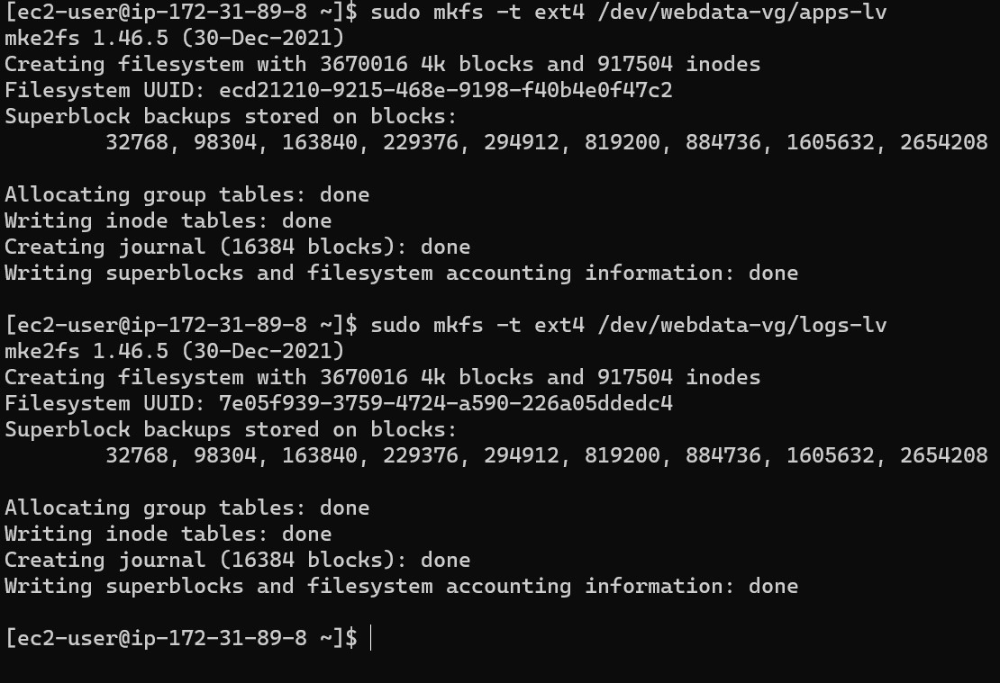

## WEB SOLUTION WITH WORDPRESS

# Three-tier Architecture is a client-server software architecture pattern that comprise of 3 separate layers.

# Presentation Layer (PL): This is the user interface such as the client server or browser on your laptop.
# Business Layer (BL): This is the backend program that implements business logic. Application or Webserver
# Data Access or Management Layer (DAL): This is the layer for computer data storage and data access. Database Server or File System Server such as FTP server, or NFS Server

# Your 3-Tier Setup

# A Laptop or PC to serve as a client

# An EC2 Linux Server as a web server (This is where you will install WordPress)

# An EC2 Linux server as a database (DB) server

`Use RedHat OS for this project`

# Step 1 — Prepare a Web and Database Server

# Created and Attached the EBS volumes to the Web and Database Servers

# Use `lsblk` command to inspect what block devices are attached to the server 

# Use `sudo ls /dev` to see all the devices in the Linux System

# Use `sudo lsblk` utility to view the newly configured partition on each of the 3 disks.

# Installation of LVM (Logical Volume Management Package)

# Checking All the disk partitions using `sudo lvmdiskscan`

# Use `sudo pvcreate` to create physical volumes

# Use `sudo vgcreate volume-group-name individual-physical-volumes` to create a volume group

# Use `sudo lvcreate -n name-of-logical-volume -L size-of-the-disk volume-group-name`

# Use `mkfs.ext4` to format the logical volumes with ext4 filesystem

# Mounting and Restoring files

