## DEVOPS TOOLING WEBSITE SOLUTION

# DevOps Tooling Solution that will consist of:

# 1- Jenkins – free and open source automation server used to build CI/CD pipelines.

# 2 - Kubernetes – an open-source container-orchestration system for automating computer application deployment, scaling, and management.

# 3 - Jfrog Artifactory – Universal Repository Manager supporting all major packaging formats, build tools and CI servers. (Artifactory).

# 4 - Rancher – an open source software platform that enables organizations to run and manage Docker and Kubernetes in production.

# 5 - Grafana – a multi-platform open source analytics and interactive visualization web application.

# 6 - Prometheus – An open-source monitoring system with a dimensional data model, flexible query language, efficient time series database and modern alerting approach.

# 7 - Kibana – Kibana is a free and open user interface that lets you visualize your Elasticsearch data and navigate the Elastic Stack.

## Components of the Infrastructure 

# 1 - Webserver Linux: Red Hat Enterprise Linux 8

# 2 - Database Server: Ubuntu 20.04 + MySQL

# 3 - Storage Server: Red Hat Enterprise Linux 8 + NFS Server

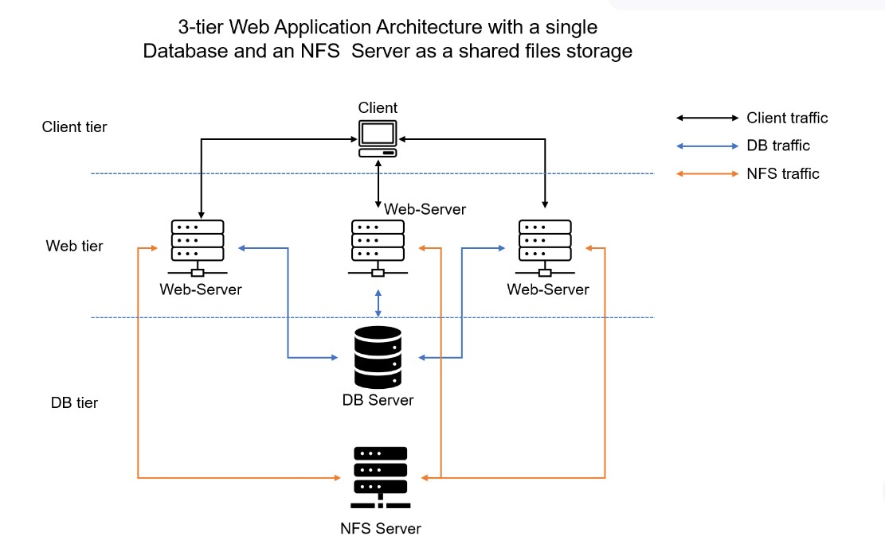

# NB: The RHEL 8 isn't available in the general AMI, you go to the public images and search for RHEL-8.6.0_HVM-20220503-x86_64-2-Hourly2-GP2

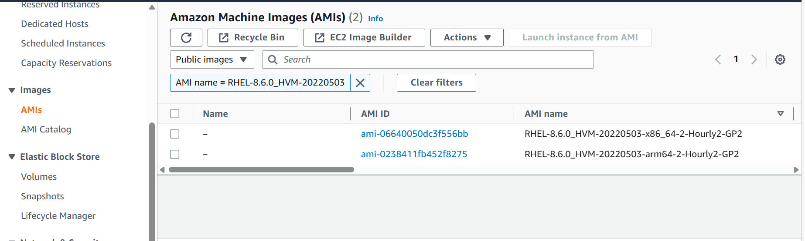

# Step 1 – Prepare NFS Server

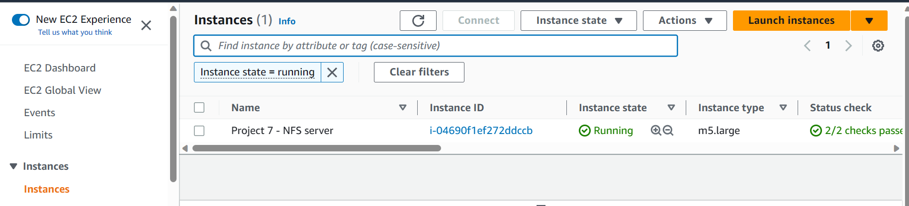

# Create 3 EBS Volumes and attach to the NFS Server

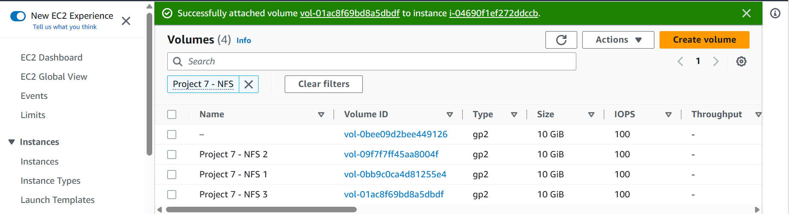

# Create 3 Logical Volumes: lv-opt lv-apps, and lv-logs

`lsblk`

# Physical Volumes | Volume Group | Logical Volumes

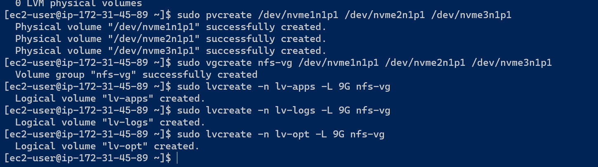

# Use mkfs.xfs to format the logical volumes with xfs filesystem

`sudo mkfs.xfs /dev/nfs-vg/lv-apps`

`sudo mkfs.xfs /dev/nfs-vg/lv-logs`

`sudo mkfs.xfs /dev/nfs-vg/lv-opt`

# Create /mnt/apps directory to store website files

# Create /mnt/log to store backup of log data

# Create /mnt/opt for the Jenkins Server

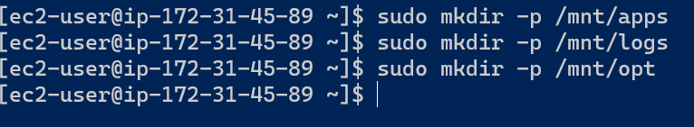

# Mount /mnt/apps on lv-apps logical volume

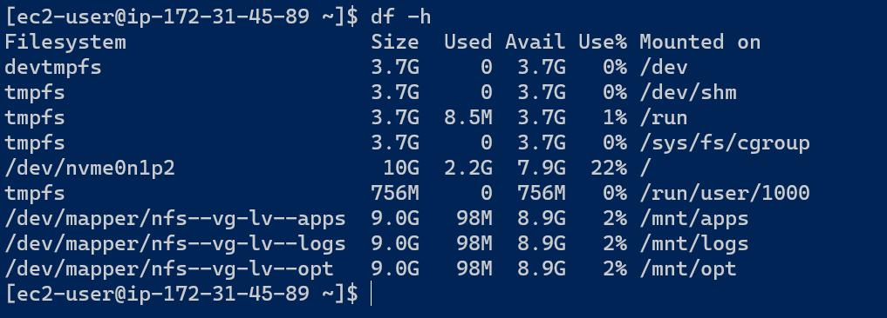

# Install NFS server

# Make sure we set up permission that will allow our Web servers to read, write and execute files on NFS:

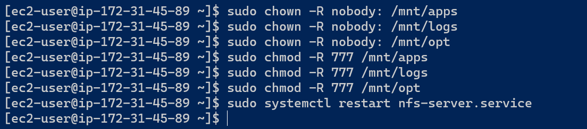

# Configure access to NFS for clients within the same subnet (example of Subnet CIDR – 172.31.32.0/20 ):

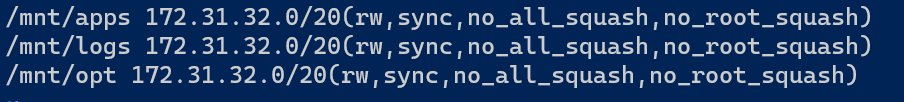

# Check which port is used by NFS and open it using Security Groups (add new Inbound Rule)

`rpcinfo -p | grep nfs`

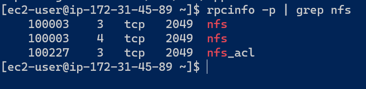

# NFS Ports opened in the Security Group

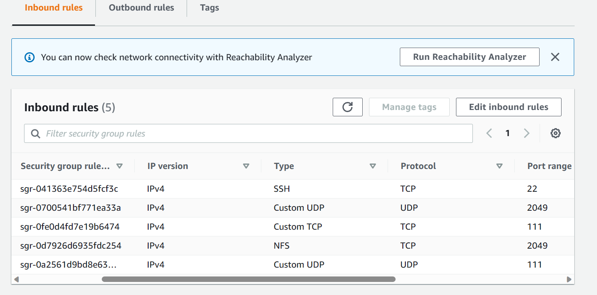

# STEP 2 — CONFIGURE THE DATABASE SERVER

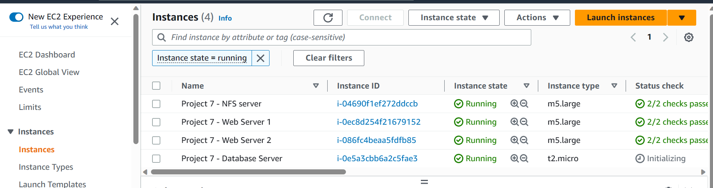

# Install MySQL server

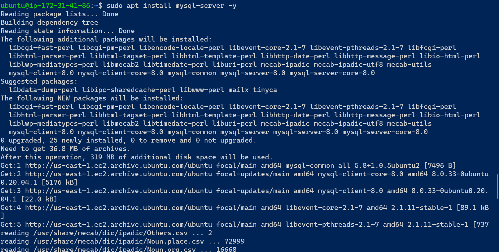