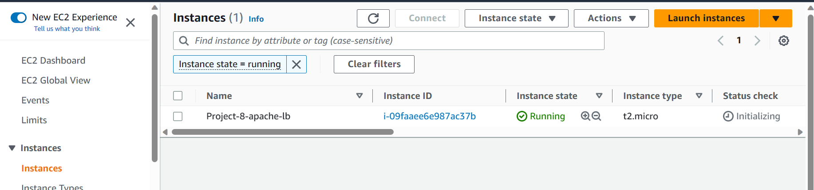
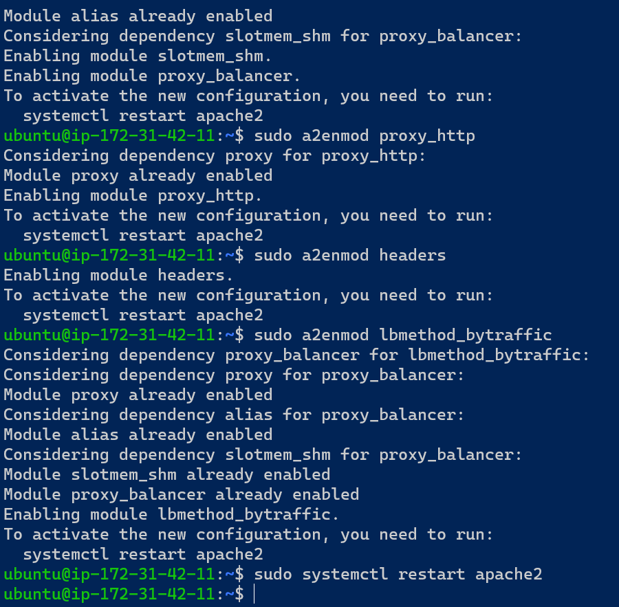
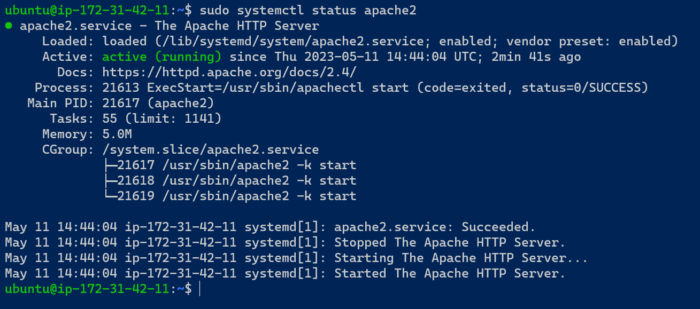

## CONFIGURE APACHE AS A LOAD BALANCER

`1 - Create an Ubuntu Server 20.04 EC2 instance and name it Project-8-apache-lb, so your EC2 list will look like this`

# Install Apache Load Balancer on Project-8-apache-lb server and configure it to point traffic coming to LB to both Web Servers:

`#Install apache2`

`sudo apt update -y && sudo apt upgrade -y`

`sudo apt install apache2 -y`

`sudo apt-get install libxml2-dev`

`#Enable following modules:`

`sudo a2enmod rewrite`

`sudo a2enmod proxy`

`sudo a2enmod proxy_balancer`

`sudo a2enmod proxy_http`

`sudo a2enmod headers`

`sudo a2enmod lbmethod_bytraffic`

`#Restart apache2 service`

`sudo systemctl restart apache2`

# Make sure apache2 is up and running

`sudo systemctl status apache2`

# Configure load balancing

`sudo vi /etc/apache2/sites-available/000-default.conf`

`#Add this configuration into this section` 

`<VirtualHost *:80>  </VirtualHost>`

`<Proxy "balancer://mycluster">`
               `BalancerMember http://<WebServer1-Private-IP-Address>:80 loadfactor=5 timeout=1`
               `BalancerMember http://<WebServer2-Private-IP-Address>:80 loadfactor=5 timeout=1`
               `ProxySet lbmethod=bytraffic`
               `# ProxySet lbmethod=byrequests`
        `</Proxy>`

        `ProxyPreserveHost On`
        `ProxyPass / balancer://mycluster/`
        `ProxyPassReverse / balancer://mycluster/`

`#Restart apache server`

`sudo systemctl restart apache2`

