## TOOLING WEBSITE DEPLOYMENT AUTOMATION WITH CONTINUOUS INTEGRATION. INTRODUCTION TO JENKINS

# Task
`Enhance the architecture prepared in Project 8 by adding a Jenkins server, configure a job to automatically deploy source codes changes from Git to NFS server.`

`Here is how your updated architecture will look like upon competion of this project:`

# INSTALL AND CONFIGURE JENKINS SERVER

`Step 1 – Install Jenkins server`

`1 - Create an AWS EC2 server based on Ubuntu Server 20.04 LTS and name it "Jenkins"`

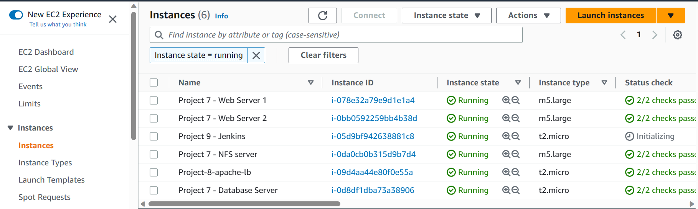

`2 - Install JDK (since Jenkins is a Java-based application)`

`sudo apt update -y && sudo apt upgrade -y`

`sudo apt install openjdk-11-jre`

`java -version`

`3 - Install Jenkins`

`curl -fsSL https://pkg.jenkins.io/debian/jenkins.io-2023.key | sudo tee \`
  `/usr/share/keyrings/jenkins-keyring.asc > /dev/null`
`echo deb [signed-by=/usr/share/keyrings/jenkins-keyring.asc] \`
  `https://pkg.jenkins.io/debian binary/ | sudo tee \`
  `/etc/apt/sources.list.d/jenkins.list > /dev/null`
`sudo apt-get update`
`sudo apt-get install jenkins`

`sudo systemctl status jenkins`

`4 - Perform initial Jenkins setup`

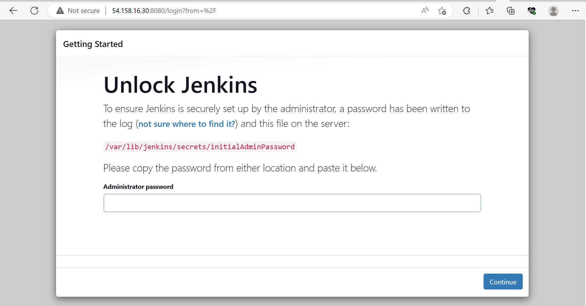

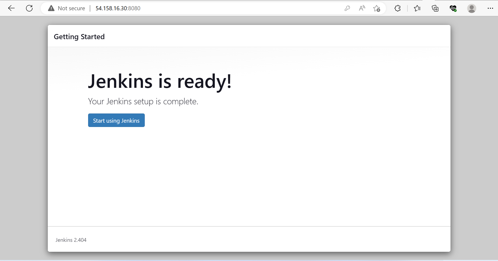

# Step 2 – Configure Jenkins to retrieve source codes from GitHub using Webhooks

` Enable webhooks in your GitHub repository settings`

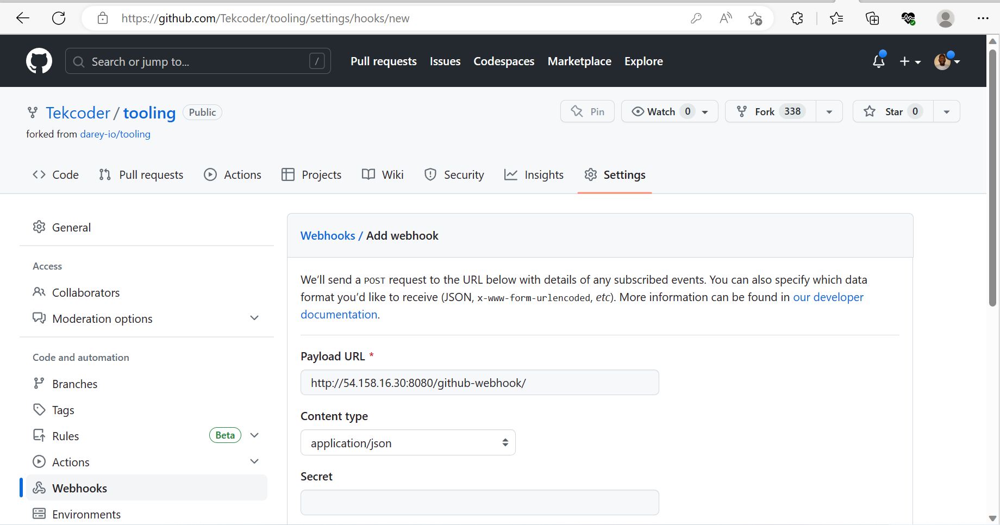

`Configure the new freestyle project and enable your first build`

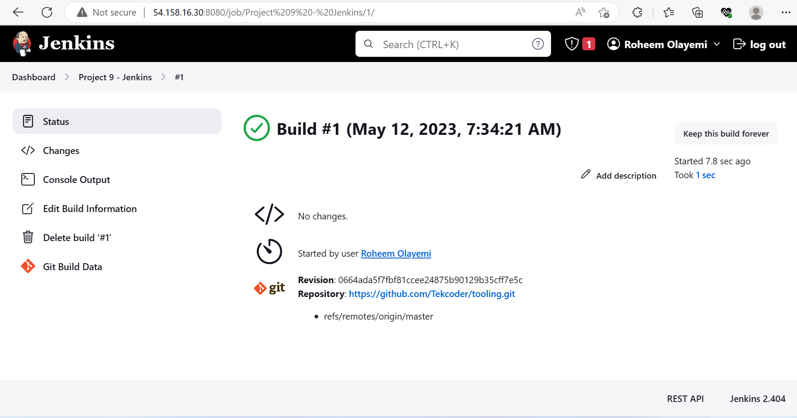

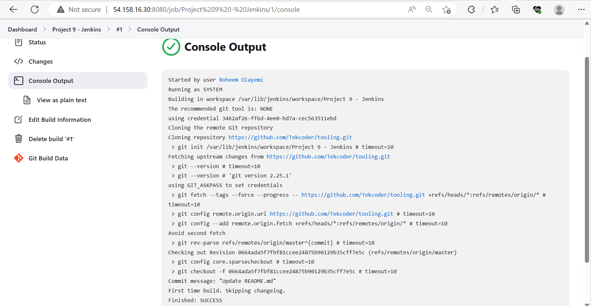

# Click "Configure" your job/project and add these two configurations

`Configure triggering the job from GitHub webhook:`

`Configure "Post-build Actions" to archive all the files – files resulted from a build are called "artifacts".`

`Make an update in the repo and the build will trigger automatically`

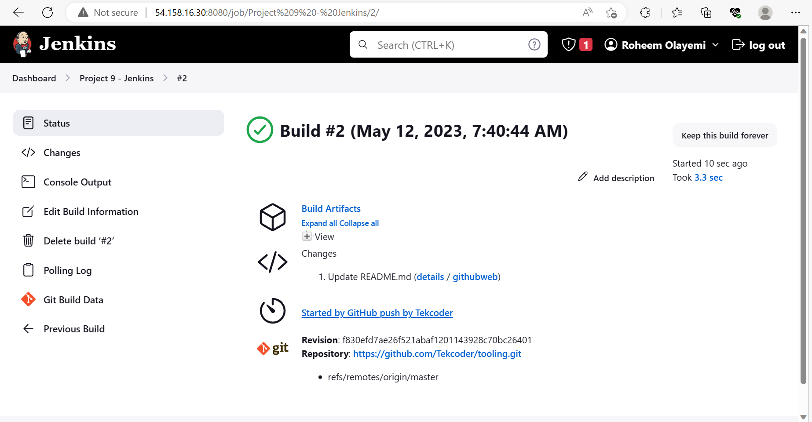

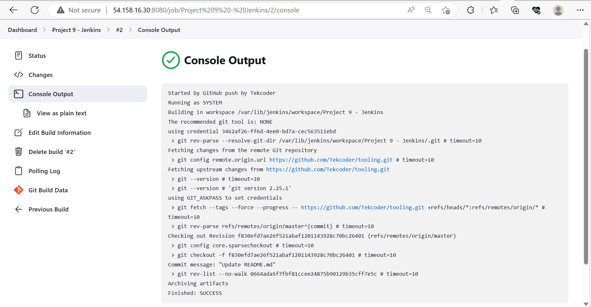

`By default, the artifacts are stored on Jenkins server locally`

`ls /var/lib/jenkins/jobs/freestyle_project_name/builds/<build_number>/archive/`

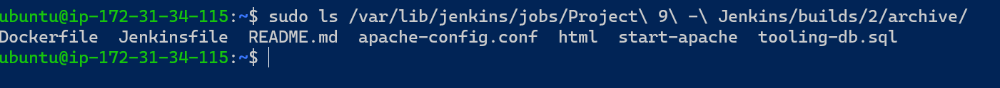

## CONFIGURE JENKINS TO COPY FILES TO NFS SERVER VIA SSH

# Step 3 – Configure Jenkins to copy files to NFS server via SSH

`1 - Install "Publish Over SSH" plugin`

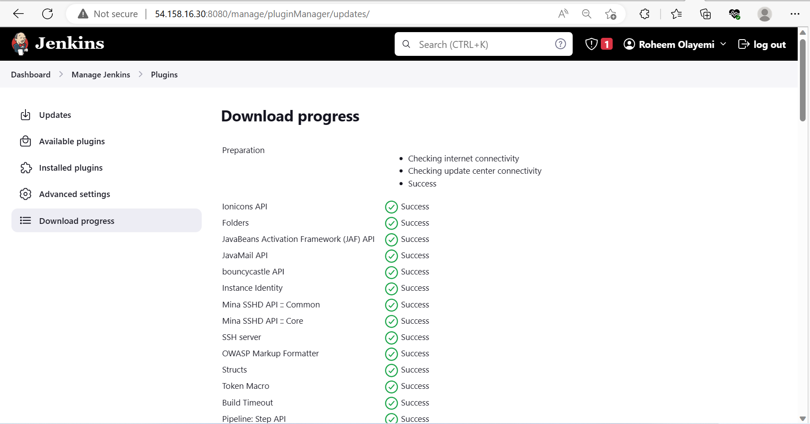

`2 - Configure the job/project to copy artifacts over to NFS server.`

`On main dashboard select "Manage Jenkins" and choose "Configure System" menu item.`

`1 - Provide a private key (content of .pem file that you use to connect to NFS server via SSH/Putty)`
`2 - Arbitrary name`
`3 - Hostname – can be private IP address of your NFS server`
`4 - Username – ec2-user (since NFS server is based on EC2 with RHEL 8)`
`5 - Remote directory – /mnt/apps since our Web Servers use it as a mointing point to retrieve files from the NFS server`

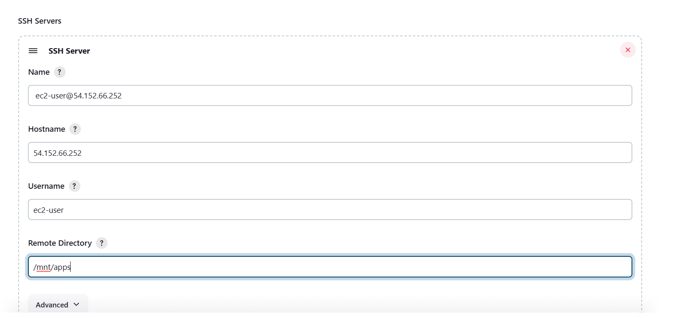

`Configure it to send all files probuced by the build into our previouslys define remote directory.`

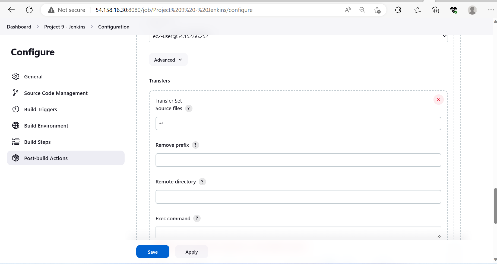

